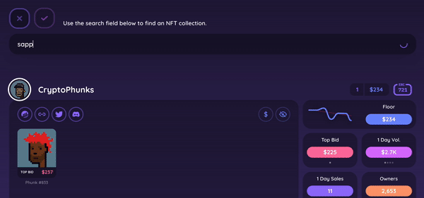

# Add Asset

We get it. NFTs get staked, transferred to hardware wallets, or snooped on ALL the time. That doesn't mean you shouldn't be able to get the same data as you would any other NFT in your wallet.

<figure><figcaption></figcaption></figure>

You're now able to do just that with the Add Asset feature. Easily search any collection, and add assets to your wallet view.&#x20;

