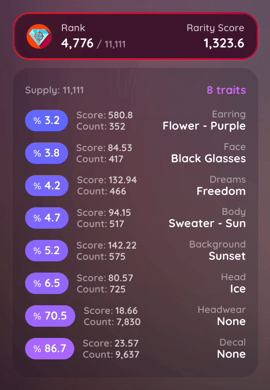

# Asset View

The asset view is accessible by clicking on a specific NFT in your collection. There are direct links to OpenSea, Rarible, LooksRare, and Etherscan. Along with the  button. **Current floor price is shown, including the purchase price, gas used, and total cost of the transaction**.&#x20;

.jpeg>)


A  label and/or  will be displayed for NFTs that were bought in a batch and/or minted.&#x20;



The Etherscan  logo on the right hand side will direct you to the transaction for that specific asset.


You can now see the rarity rank & score of projects supported by Rarity Sniper in the Asset View. This also includes rarity score and more rarity info that you can expand for each trait.

 (6).gif>)


View the sales history of each token by hovering over the coloured dots on the left.

 –– Minted

 –– Transfer

 –– Sale

