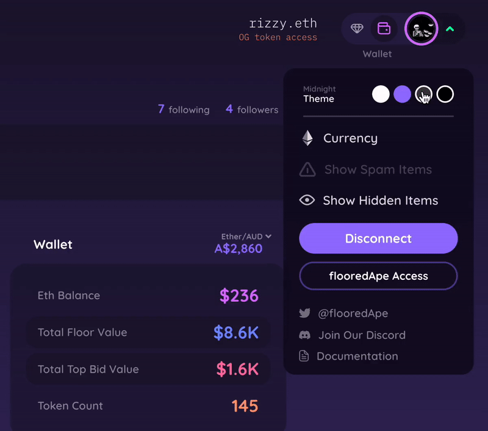

# Main Menu Dropdown

The menu/avatar toggle houses all actions related to the user's account and settings. The following functions are available for logged in/connected users:

* Currency conversion (ETH, USD, CAD, EUR, GBP, AUD, CNY, JPY)
* Color scheme selection
* Toggle to show/hide hidden items
* "Fetch Latest Data"
* Disconnect&#x20;
* Link to flooredApe Access Token mint page and other social platforms
* Toggle between Market Overview(public) & Wallet Portfolio (Token gated)

&#x20;                                                &#x20;

<figure><figcaption></figcaption></figure>


Users can also switch from [wallet-view.md](wallet-view.md "mention") to [market-overview.md](market-overview.md "mention"), by selecting between the two icons near the dropdown menu 

