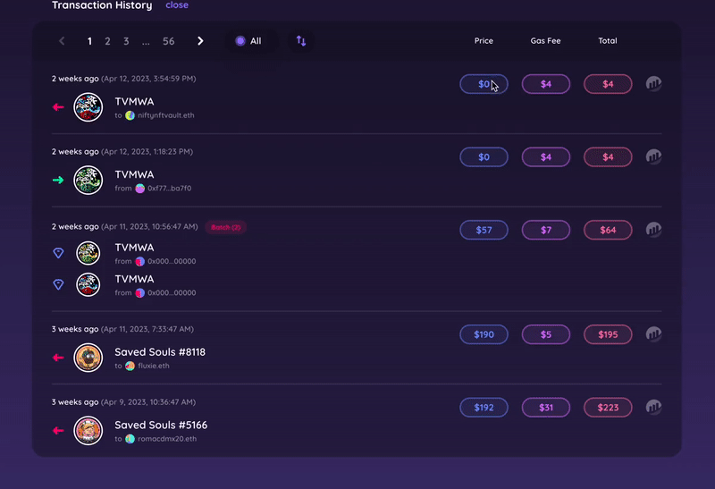

# Transaction History

Keep track of your wallet transactions including the purchase price, gas used, and total for each.

Each transaction is in chronological order. You will also find the date and time of purchase and transaction link to [etherscan](https://etherscan.io).

<figure><figcaption></figcaption></figure>


Sort your transaction history by tx type or chronological order



 The green right arrow indicates your purchases and received transfers.

 The left red arrow indicates sold and outgoing transfers.

 The purple diamond indicates that it was minted.

 The parachute indicates that it was airdropped.

 This Icon refers to batch transactions&#x20;


