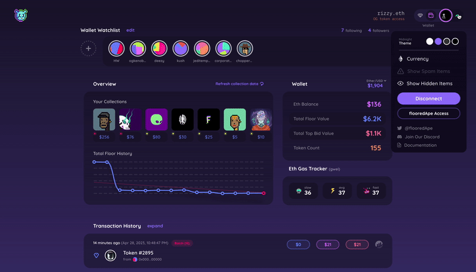

# Wallet View

The Wallet View is the main dashboard of flooredApe. From here, you're able to access every feature we offer with a few clicks.

<figure><figcaption></figcaption></figure>

At the top of the screen, you will be greeted by a few flooredApe staples.

* [main-menu-dropdown.md](main-menu-dropdown.md "mention") & [wallet-watchlist.md](wallet-watchlist.md "mention") at the very top.
* [collection-overview.md](collection-overview.md "mention"), [balances.md](balances.md "mention") & [gas-tracker.md](gas-tracker.md "mention") front & center.
* Below you can find [transaction-history.md](transaction-history.md "mention"), [add-asset.md](add-asset.md "mention") & [search-and-sort.md](search-and-sort.md "mention")

Below these key features, you will be able to find your entire NFT portfolio, displayed in one of two views. Default View - larger images, more analytics at a glance, or List View - short, sweet, and easy to sort.

<figure><figcaption></figcaption></figure>

You are now faced with a slew of analytics: Floor, bids, sales, volume, and owner data can all be viewed at a glance. However, floor price can be popped out with an interactive chart. You can then easily navigate to [asset-view.md](asset-view.md "mention") or [collection-view.md](collection-view.md "mention"), each with its own respective data and insights.


* Navigate to Asset View by clicking on any Asset&#x20;
* Navigate to Collection View by clicking on any collection's name.

